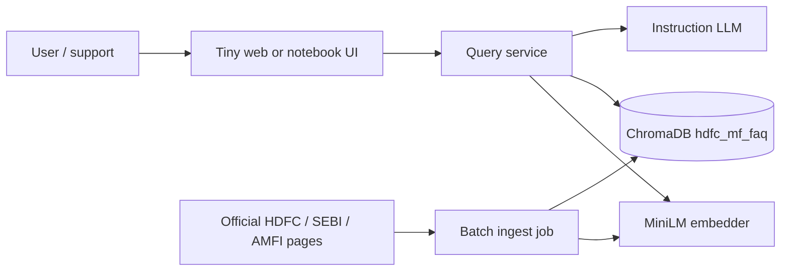
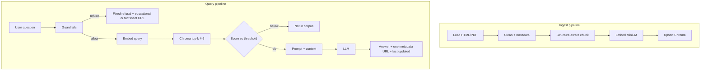

# Architecture: HDFC Mutual Fund FAQ RAG Chatbot

**Source of truth:** `PRD.md`  
**Last updated:** 29 Sep 2026  
**Style:** Offline-first prototype; full RAG stages visible in code

This document describes **how** the product in `PRD.md` is built. Product rules (facts-only, one citation, refusals) stay in the PRD; this file covers components, data flow, and contracts.

---

## 1. Design goals

1. **Two pipelines, all RAG stages:** ingestion (load → chunk → embed → store) is separate from query (embed → retrieve → generate).
2. **Grounded answers only:** the LLM never answers scheme facts without retrieved chunks.
3. **Citation integrity:** the source URL is taken from chunk metadata, not generated by the model.
4. **Scheme isolation:** chunk prefixes + optional metadata filters stop Flexi Cap facts mixing with Large Cap.
5. **Safety at the edge:** PII / advice / returns comparison are handled before or instead of retrieval, per PRD §6.
6. **Reproducible prototype:** local ChromaDB, documented ingest command, no per-query crawl.

---

## 2. System context



**External systems**

| System | Role |
|---|---|
| HDFC / SEBI / AMFI public URLs | Corpus only; fetched at ingest time |
| Embedding model `sentence-transformers/all-MiniLM-L6-v2` | Same model for documents and queries (384-dim) |
| ChromaDB (persistent local dir) | Vector + metadata store |
| LLM (local or API) | Generation from retrieved context only |

No user accounts, no KYC, no live AMC APIs.

---

## 3. High-level architecture

Two runtimes share the embedder and Chroma collection.

| Runtime | When | Stages |
|---|---|---|
| **Ingest** | Batch, on demand (`python ingest.py` or equivalent) | Loading → Chunking → Embedding → Storing |
| **Query** | Each user message | Guardrails → (optional) query embed → Retrieval → Generation → Format |



---

## 4. Logical components

| Component | Responsibility |
|---|---|
| **UI** | Welcome, 3 example questions, facts-only note, disclaimer, chat, render answer + source + date |
| **Query API / app layer** | Accept question, run guardrails, call retriever + generator, return structured response |
| **Guardrails** | Detect PII, advice, returns-comparison, out-of-scope AMC/scheme |
| **Loader** | Fetch allowlisted URLs; HTML strip / PDF extract; write raw + cleaned docs |
| **Chunker** | Heading/table-aware splits; token window 256–400, overlap 40–80; prefix `Scheme \| Doc \| Section` |
| **Embedder** | Wrap MiniLM; embed chunk text (with prefix) and queries |
| **Vector store** | Chroma collection `hdfc_mf_faq` |
| **Retriever** | Query embed, optional `scheme` filter, top-k, similarity threshold |
| **Generator** | System prompt (PRD W2); context = retrieved chunks only; pick citation from best chunk `url` |
| **Source catalog** | CSV/MD of 15–25 URLs (`doc_type`, `scheme`, `priority`) |

---

## 5. Ingest pipeline (data ingestion)

Run as a **batch job**. Do not crawl the live site on every chat turn.

### 5.1 Loading

1. Read source catalog (allowlist only).
2. HTTP GET each URL (and linked official PDFs from the factsheets hub when present — PRD recommends yes).
3. Parse:
   - HTML: main content, headings, tables; drop nav/footer/cookie chrome.
   - PDF: text + tables by page/section.
4. Write:
   - `data/raw/` — original bytes or HTML snapshot
   - `data/cleaned/` — plaintext + YAML/JSON sidecar metadata

**Document metadata (required)**

```text
url          string   canonical source URL (this becomes the citation)
title        string
scheme       string | null   one of the 5 in-scope names, or null for hubs/how-tos
plan         "Direct" | "Regular" | null
doc_type     factsheet | kim | sid | faq | how-to | listing | scheme-page
fetched_at   ISO-8601 date
priority     high | low     listing pages = low (down-rank or exclude from default retrieval)
```

### 5.2 Chunking

Structure-aware, not a single naive character split.

| `doc_type` | Rule |
|---|---|
| `scheme-page` | Split on headings / cards / table groups. One fact family per chunk (exit load, riskometer, SIP min). |
| `how-to` / `faq` | Split on H2/H3; keep a numbered step sequence in one chunk when it fits. |
| `factsheet` / `kim` / `sid` | Section/page split; **do not split a table across chunks**. |
| `listing` | Coarse chunks or skip default retrieval (`priority: low`). |

**Size:** ~256–400 tokens, overlap ~40–80 tokens.

**Every chunk text starts with:**

```text
Scheme: <name or None> | Doc: <doc_type> | Section: <heading>
```

This is the main defence against MiniLM retrieving the wrong scheme’s expense ratio.

### 5.3 Embedding

- Model: `sentence-transformers/all-MiniLM-L6-v2`
- Input: prefixed chunk text
- Output: 384-float vector
- Query-time model **must** be identical (same weights, same pooling)

### 5.4 Storing (ChromaDB)

- Persist path e.g. `chroma/` (gitignored except empty placeholder)
- Collection: `hdfc_mf_faq`
- On re-ingest: **wipe collection or upsert by stable `chunk_id`** so stale expense ratios do not linger

**Chroma record**

| Field | Content |
|---|---|
| `id` | Stable hash: `sha1(url + section + chunk_index)` |
| `embedding` | MiniLM vector |
| `document` | Prefixed chunk text (what the LLM sees) |
| `metadata` | `url`, `scheme`, `doc_type`, `section`, `fetched_at`, `priority`, `title`, `plan` |

---

## 6. Query pipeline (data retrieval + generation)

### 6.1 Guardrails (before retrieval)

Order of checks:

1. **PII patterns** (PAN-like, Aadhaar-like, long digit runs, OTP, emails, phones) → do not log the raw message; reply with “do not share PII”; optional generic process if still in corpus without using the PII.
2. **Advice / suitability** (“should I buy”, “best fund”, “switch”) → refusal + one fixed educational official URL (AMFI/SEBI/HDFC learn). **No retrieval required.**
3. **Returns / comparison / performance math** → do not compute; return factsheet hub or scheme factsheet URL from catalog.
4. **Scheme named but not in the 5** → out-of-scope message listing covered schemes.
5. Else → retrieval path.

Guardrails implement PRD W1 (answer vs refuse) without relying on the LLM to “be good”.

### 6.2 Query embedding and retrieval

1. Embed the (PII-stripped) question with MiniLM.
2. If a known scheme is detected (keyword / simple alias map), Chroma `where={"scheme": "..."}`.
3. Query `n_results = 4..6`. Prefer `priority != low` when the collection supports it (filter or post-filter).
4. **Threshold:** if top similarity is below a configured cutoff (tune on sample Q&A; start conservatively, e.g. cosine distance too high / similarity too low), return “not in indexed official pages” — do **not** call the LLM for a factual invention.

### 6.3 Generation

**Context packing**

```text
[chunk 1 text]
SOURCE_URL: <metadata.url>
FETCHED_AT: <metadata.fetched_at>

[chunk 2 ...]
```

**System prompt (W2) — behaviour contract**

- Use **only** the provided chunks.
- ≤3 sentences.
- No investment advice; no return calculations.
- If chunks conflict or lack the fact, say so.
- Do not invent URLs.

**Citation rule (application, not the model)**

- `source_url` = `metadata.url` of the **highest-scoring chunk that the answer actually used** (default: rank-1 chunk if the model did not flag insufficient context).
- `last_updated` = max `fetched_at` among chunks used (or ingest run date).

The UI must display these fields even if the model omits them.

### 6.4 Response contract

```json
{
  "answer": "string, ≤3 sentences",
  "source_url": "https://...",
  "last_updated": "YYYY-MM-DD",
  "refusal": false,
  "refusal_reason": null
}
```

Refusals still include `source_url` (educational or factsheet) per PRD.

---

## 7. UI architecture

Single page / notebook cell. No auth.

| Element | Source |
|---|---|
| Welcome line | Static copy |
| 3 example questions | Static; click fills input and submits |
| Banner | “Facts-only. No investment advice.” |
| Disclaimer | PRD §6 snippet |
| Chat | Question → JSON response → render body, link, date |

State: in-memory turn list only. Do not persist messages (PII risk).

---

## 8. Suggested repo layout

```text
BUILDHOURS/
  PRD.md
  architecture.md
  README.md
  sources.csv                 # 15–25 URLs + metadata
  sample_qa.md
  app.py                      # UI + query pipeline
  ingest.py                   # load → chunk → embed → store
  rag/
    load.py
    chunk.py
    embed.py
    store.py
    retrieve.py
    generate.py
    guardrails.py
  data/raw/                   # gitignored
  data/cleaned/
  chroma/                     # gitignored persistence
  prompts/system.txt
```

Exact names can change; **stage boundaries must remain visible** (success criterion: pipeline visible in code).

---

## 9. Tech stack

| Layer | Choice |
|---|---|
| Language | Python 3.11+ (prototype) |
| Embeddings | `sentence-transformers/all-MiniLM-L6-v2` |
| Vector DB | ChromaDB, persistent |
| HTML | e.g. BeautifulSoup / readability-style extract |
| PDF | e.g. pypdf or pymupdf |
| LLM | Open decision (Ollama local **or** API); RAG stages unchanged |
| UI | Streamlit / Gradio / FastAPI+HTML — any tiny UI |

---

## 10. Security and privacy

- Allowlist fetch: only URLs in `sources.csv`.
- Strip/redact PII before any log or LLM call.
- No PAN/Aadhaar/account/OTP/email/phone in Chroma (corpus is public pages only).
- Secrets (API keys) in env, not repo.
- Do not screenshot or scrape authenticated app backends (PRD).

---

## 11. Failure modes and mitigations

| Failure | Mitigation |
|---|---|
| JS-heavy scheme page has no TER/load in HTML | Ingest official PDF factsheet/KIM/SID |
| Wrong scheme retrieved | Prefix + `scheme` filter + listing `priority: low` |
| Stale charges after AMC update | Re-run ingest; `fetched_at` on every answer |
| LLM invents a URL | UI overwrites with metadata `url` |
| Low-score retrieval | Threshold → “not in corpus” |
| Listing pages dominate k | Exclude `doc_type=listing` from default query |

---

## 12. Configuration (tune without code changes)

| Knob | v1 default | Why |
|---|---|---|
| `chunk_tokens` | 256–400 | MiniLM + table facts |
| `chunk_overlap` | 40–80 | Avoid splitting labels from values |
| `top_k` | 4–6 | Small corpus |
| `similarity_threshold` | Tune on sample Q&A | Stop hallucinations |
| `collection` | `hdfc_mf_faq` | Single AMC v1 |

---

## 13. Mapping to PRD

| PRD | Architecture |
|---|---|
| §7.1–7.4 Ingest stages | §5 |
| §7.5–7.6 Retrieve + generate | §6 |
| §6 UX / refusals | §6.1, §7 |
| F1–F9 | UI + query service |
| F11–F12 sources + sample Q&A | Catalog + eval set for threshold tuning |
| Latency &lt; 10s | Local Chroma + no live crawl |
| W3 RAG only | No unaugmented factual generation |

---

## 14. Out of scope for this architecture

Matches PRD §10: no recommendations, no NAV/return engines, no multi-AMC, no user store, no fine-tuning. Adding those would be a new architecture revision.
